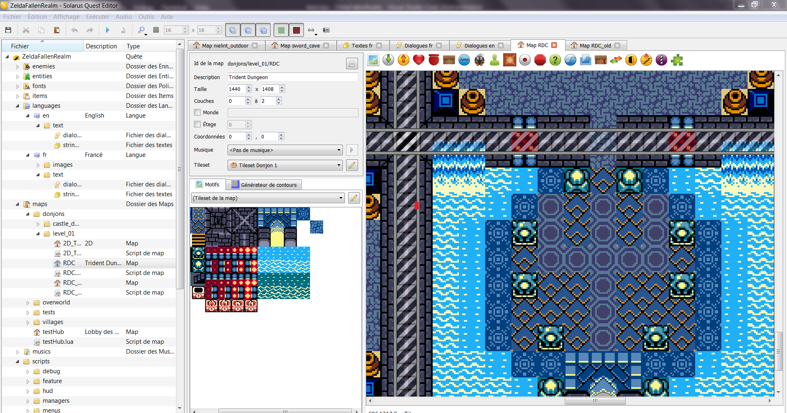
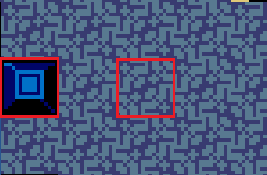
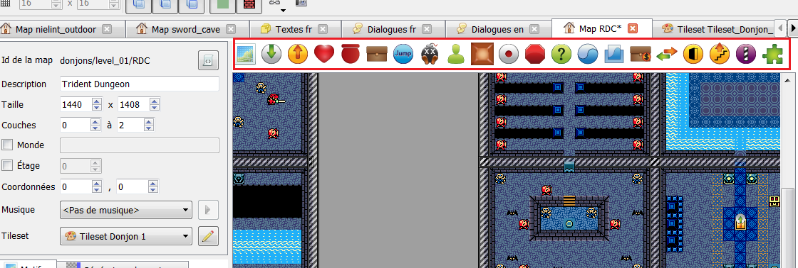

# Guide de création des maps
Les maps sont les environements où Link évoluera dans le jeu. Elles sont donc fondamentales à son fonctionnement.

Les maps sont composées d'un décor "inerte" (donc à peu de chose près, une image de fond et des éléments de terrain), les tiles ; et d'entités dynamiques généralement contrôlées par un script (dont Link !). 
Dans ce guide je présenterai la méthode à suivre pour créer et éditer des maps, placer les tiles, et les entités, etc. 
(Il est à noter que chaque map est liée à un script Lua ; il n'est pas nécessaire de réellement coder ce script pour créer une map, cependant une map avec un fonctionnement complexe nécessitera un peu de code.)

Il n'est pas nécessaire d'utiliser un autre logiciel que l'éditeur solarus pour éditer les maps.

Avant de commencer, ouvrez donc l'éditeur solarus et ouvrez une map en double-cliquant dessus dans l'arborescence à gauche ; ou créez en une avec clic droit sur le dossier qui la contiendra (les maps sont toujours organisées en dossiers) -> Nouvelle map.


A droite, l'aperçu de la map ; dans la partie centale haute vous pouvez modifier certains propriétés de votre map, telles que sa taille ou la musique qui se jouera dessus.

Comme expliqué précédemment, la map est composée d'un décor et d'éléments dynamiques posés dessus.

## Les tiles

Le décor d'une map est composé d'une multitude de petites images, appelées patterns ou tiles, généralement de taille 8x8 ou 16x16, souvent répétés.  

**Exemple** : sur cette image, on peut voir deux patterns différents, de 16x16 pixels chacune.
  
Celui de gauche n'est présent qu'une fois, mais celui de droite à été répétée pour créer le  sol.  
Il est important de noter que si le pattern a été répété, il s'agit pour Solarus d'une seule et même grande tile. (Retenez qu'une **tile** peut être composée d'une répétition de **paterns**)

#### [Tilesets](tilesets.md)
Les patterns/tiles sont regroupées sur des **tilesets**, de grandes images contenant toutes les tiles nécessaires à une map (on trouvera par exemple un tileset pour les maisons de base, un pour le donjon 1, un pour le monde extérieur, etc). 
Chaque map est liée à un tileset, sélectionnable dans le menu déroulant en bas des propriétés de la map, et les tiles que vous y placerez proviendront de ce tileset *par défaut*, il est cependant possible de placer des tiles provenant d'un autre tileset (en changeant le tileset affiché en bas à gauche grâce au menu déroulant juste au dessus). On peut alors se poser la question : pourquoi définir un "tileset de la map" si on peut de toute façon utiliser des tiles de n'importe quel tileset ? Premièrement, parce que c'est plus pratique d'avoir un tileset par défaut étant donné d'en général la map contiendra *surtout* des tiles venant d'un seul et même tileset, mais aussi pour une autre raison liée au fonctionnement des sprites, que l'on verra dans la partie qui leur est dédiée.

(note : vous pouvez aussi aller voir le tileset directement, avec chaque pattern et leurs propriétés dont on parlera plus tard, dans le dossier `data/tilesets/`, ou en cliquant sur l'icône crayon à côté du tileset sélectionné)

#### Placer des tiles

Une fois le tileset choisi, il apparaît en dessous de propriétés, juste à droite de l'aperçu de la map.  
A partir de là, c'est très simple : on clique sur un pattern pour le sélectionner, puis on clique sur la map là où on veut placer la tile.  
Il existe quelques subtilités que j'ajouterait plus tard (mais n'hésitez pas à demander à Zuna en attendant), mais en voici quelques unes assez indispensables :

- Maintenir clic gauche appuyé quand on place une tile sur la map et déplacer la souris dans une direction répète la tile, utile pour les grandes surfaces constituées d'une seule tile répétée. Certaines tiles ne peuvent pas être répétées ; d'autres ne peuvent l'être que dans une seule direction (ex : les murs horizontaux ne peuvent être répétés qu'à l'horizontale, etc)
- Double-clic sur une tile pour afficher ses propriétés : il y est par exemple possible de changer manuellement leur position et leur taille.

Il est important de noter que certains tiles sont animées (toutes les frames de l'animation sont présentes côte à côte sur le tileset).

Note : certaines tiles doivent parfois se chevaucher : pour décider de laquelle s'affiche au dessus, clic-droit -> mettre à l'arrière-plan / mettre au premier plan. (voir aussi le paragraphe "couches")


#### Type de terrain

De plus, il s'avère qu'en réalité j'ai menti : les tiles ne sont pas uniquement un décor inerte ; certaines peuvent interagir avec les entités. En effet, les tiles possèdent un *type de terrain* (on ne peut d'ailleurs pas savoir le type de terrain d'une tile dans l'éditeur de map : pour savoir le type de terrain d'une tile, allez voir directement le tileset).  
Ces types sont :  

- Traversable : aucun effet.
- Mur : Est considéré comme un obstacle pour les entités.
- Muret : Par défaut, exactement pareil, cependant j'ai codé certaines entités de manière à passer au dessus, comme les flèches ou les entités volantes.  
- Vide : comme traversable, avec une différence que l'on verra au prochain paragraphe.

Les autres ont des effets plus particuliers, et sont assez explicites :

- Trous, piquants, eau profonde, lave : tiles qui auront chacune un effet particulier sur les entités passant dessus, en particulier sur Link (tue les monstres directement, et inflige des dégâts à Link avant de le faire revenir en arrière).
- Eau peu profonde, herbe : Modifie un peu l'animation de Link et joue un son lorsqu'il marche dessus. 
- Et qques autres un peu osef

#### Couches
En effet, les maps se sont pas des environements *entièrement* 2D : les tiles peuvent être à différentes hauteurs, symbolisées par des couches/layers. Toutes les tiles sont par défaut à la couche 0, mais on peut changer ça avec un simple clic-droit sur la tile. On peut aussi voir ça comme : chaque couche est un ensemble de tile indépendant des autres.
Le système est assez simple, les tiles de la couche 1 s'affiche toujours au dessus de la couche 0, et ainsi de suite.

Nous y reviendront dans la partie dédiée, mais les entités se trouvent toujours sur une couche : si Link se trouve sur une couche, il y restera tant qu'il y a une tile Traversable sous ses pieds à la même couche que lui ; s'il se retrouve sur un tile avec Vide comme type de terrain, ou juste un endroit sans tile, il "tombera" (descendra les couches jusqu'à retomber sur une tile non vide ou à la couche 0. Cela n'a pas d'effet in-game autre qu'un changement de couche, qui ne provoque par ailleurs aucun effet visible (en somme, si link tombe d'une couche à la couche d'en dessous, visuellement rien ne se passe)).  
Les entités n'interragissent qu'avec les tiles à leur couche, c'est à dire que si Link se trouve à la couche 1, il pourra sans problème "traverser" des tiles Mur situées sur la couche 0 ou la couche 2, tant qu'il y a une tile traversable à cet endroit sur la couche 1.

Il est important de noter qu'au sein d'une même couche, les tiles sont "empilées" : chaque tile possède sa position précise dans la liste des tiles de cette couche, la haut de cette liste étant le "premier plan". Cela n'a d'importance que pour les tiles qui se chevauchent : dans ce cas, celle qui est le plus proche du premier plan sera affichée "par dessus" l'autre, et seul son terrain sera pris en compte pour la zone de chevauchement.  
Exemple : Si une tile Traversable est répétée pour créer une grande tile sur la map, et qu'on vient placer au milieu une tile Mur simple, les deux étant à la **même couche**.
- Si la tile Mur se trouve "sous" la tile Traversable, elle ne sera pas visible et son terrain ne sera jamais pris en compte
- Si la tile Mur se trouve au dessus, la tile Traversable restera traversable, sauf pour l'emplacement de la tile Mur qui sera bien considéré comme un obstacle.

Pour changer cet ordre, clic droit sur une tile -> envoyer à l'arrière plan OU envoyer au premier plan. A *ne pas confondre* avec les deux options juste au dessus, qui changent la **couche** de la tile.

(note: les entités sont toujours affichées au dessus des tiles de leur couche ; pour qu'une tile s'affiche par dessus Link, il faudra la placer sur une couche supérieure à celle où se trouvera Link)

## Entités

Tandis que les tiles sont la partie inerte de la map, sa base, qui ne pourra pas changer pendant le jeu, les entités sont des objets capables de se déplacer, apparaître ou disparaître, effectuer diverses actions, pendant le jeu. Elles seront donc, contrairement aux tiles, contrôlables par les scripts du jeu.   
Certaines seront gérées par le jeu, mais la plupart devront être placées sur la map au même titre que les tiles.

Il existe de nombreux types d'entités, qui seront décrits plus bas.

Pour placer des entités, cliquez simplement sur les icones correspondantes au dessus de l'aerçu de la map, puis placez les comme des tiles.
  
Lorsque vous placez une entité, une fenêtre s'affiche, vous permettant de modifier ses propriétés, notament son nom, sa taille (rarement utile) ou le sprite qui y est associé, ainsi que beaucoup d'autres propriétés spécifiques à chaque type d'entité.

Il est à noter que les sprites des entités auront souvent un fonctionnement particulier, qui sera expliqué dans la partie Sprites.

### Propriétés Custom
Outre les propriétés de base des entités (nom, taille, position) et les propriétés spécifiques à chaque type d'entité, il est possible d'affecter des propriétés particulières aux entités, avec le nom qu'on veut. C'est d'ailleurs nécessaire pour contrôler les fonctionnement de certaines entités.  
Pour cela, il faut regarder la partie "propriétés utilisateur", en bas de la fenêtre de configuration des entités, cliquer sur le "+" vert, et spécifier le nom de la propriété et sa valeur. En effet, une propriété custom est composée d'un nom et d'une valeur (les deux étants des textes).  
Dans ce guide, je présenterai généralement les propriété avec le format `nom : valeur`. Si la valeur contient un élément entre brackets `<>`, il est à comprendre qu'il faut remplacer cette partie (incluant les brackets) par ce qui est décrit à l'intérieur.

Les propriétés custom n'ont aucun effet *par défaut* dans solarus, mais Fallen Realm possède des scripts qui donnent certains effets à certains propriéts particulères.  

### Les différents types d'entités

##### Hero
Le personnage jouable, c'est à dire Link dans notre jeu. Cette entité existe toujours sur la map et est entièrement gérée par le jeu, vous n'avez donc pas besoin de la créer.

##### Destination
Entité n'ayant aucun effet. Elles sont cependant très utiles dans la mesure où elles permettent de "marquer" une position : lorsque Link doit être téléporté (ce qui inclut surtout le moment où il arrive sur la map) il est généralement envoyé vers une destination. Il est donc important de donner des noms explicites aux destinations.  
Note : il est possible d'indiquer qu'une destination est la detination par défaut de la map : elle sera utilisée si on téléporte Link vers cette map sans spécifier de destination.

Une destination possède deux paramètres important : 
- Une direciton, qui sera celle que link aura en étant téléporté à cette destination
- Le comportement lié à la sauvegarde : vous pouvez choisir de faire en sorte que cette destination devienne le point de respawn de Link (l'endroit où il reviendra en mourrant, où si le joueur quitte le jeu) quand il y est téléporté. Par défaut, toutes les destinations feront ça.

(note : il est possible de donner un sprite à une destination mais ce n'est généralement pas utile.)

##### Téléporteurs
Si Link se trouve sur un téléporteur, il sera envoyé vers la map et à la destination spécifiées dans les propriétés. 
Il est également possible de spécifier dans les propriétés le type de transition (fondu, immédiat ou scrolling. Le type scrolling est complexe à utiliser et nécessitera des explications supplémentaires).
Ils seront généralement couplés avec une destination placée à peu près au même endroit. En effet, on les utilisera généralement pour une transition entre deux maps : par exemple, pour l'entrée d'une maison, à l'extérieur on mettra une destination nommée "maison\_to\_outdoor" et un téléporteur au niveau de la porte, et à l'intérieur une destination "from\_outdoor" et un téléporteur à l'entrée de la maison ; le téléporteur de dehors envoyant donc vers la map de la maison à la destination "from\_outdoor" et vice versa.

Il est possible de donner un sprite à un téléporteur mais ce n'est généralement pas nécessaire)

#### Porte
Une porte est une entité qui se comporte, de base, comme un mur. Elles peuvent être **ouvertes**, ce qui signifie qu'elles deviennent traversables.  
Les portes peuvent toujours être ouvertes (et fermées, plus rarement) par le script de la map, cependant il est possible de les configurer de manière à ce que Link puisse les ouvrir en interragissant avec. Les différents modes sont : 
- Script de la map : seul le script peut ouvrir la porte
- Par le héros : Link peut ouvrir la porte
- Par le héros, variable sauvegardée nécessaire : Link peut ouvrir la porte, si une certaine variable de sauvegarde est présente (voir partie [Sauvegarde](savegame.md))
- Par le héros, item nécessaire : Link peut ouvrir la porte s'il possède un certain [Item](items.md). Il est alors possible de spécifier que l'item sera perdu (pour un item sauvegardé) ou que Link en perdra un (pour un Item à quantité). Voir la partie [Items](items.md) pour une explication de ces concepts.

Il est possible (et très fortement recommandé) de donner un sprite à une porte, qui prendra la direction indiquée dans les paramètres de la porte.  
Solarus effectue diverses actions sur le sprite d'une porte, qui seront décrites plus précisément dans la partie [Sprites](sprites.md), retenez surtout que lorsqu'une porte est fermée, elle prend l'animation "closed", et "open" quand elle est ouverte.

##### Trésor ramassable
Un item que link obtiendra s'il le touche. Le concept d'item est très large dans Solarus, dépendant de la manière dont c'est codé ça peut désigner autant un objet de l'inventaire qu'un réceptacle de coeur ou un rubis : voir le guide Items
Les trésors sont en réalité rarement placés directement sur la map (+ souvent drop par des enemis).  
Lorsque vous placez un trésor, vous devez choisir l'item dont il s'agit, mais également sa variante. La variante peut avoir de nombreuses significations (pour un rubis : sa couleur, pour l'épée, son niveau, etc). Des informations sur les différents items (dont la significations de leurs variantes) sont disponibles sur le google doc.

Les items que peuvent représenter les trésors ramassables regroupent par exemple :  

- Les items utilisables (dont l'épée)
- Les rubis
- Les coeurs
- Les fragments/réceptacles de coeur
- Les clés

Il est également possible de spécifier que l'état du trésor est sauvegardé, et d'y associer une variable de sauvegarde : cela fera en sorte que le trésor ne réapparaitra pas (CàD, ne spawnera plus si la map est chargée) une fois récupéré.  (la variable de sauvegarde sera donc utilisée pour conserver l'état de ce trésor s'il a déjà été acheté ; voir la partie Item et sauvegarde).  Ce sera généralement le cas pour les items placés directement sur la map, tandis que les trésors ramassables qui ne sont pas sauvegardés seront surtout ceux générés par solarus, comme les items droppés par les enemis ou les buissons par exemple.

(note : on ne donne pas de sprite à un trésor, le sprite de cette entité est toujours celui associé à l'item en question)

##### Destructible
Objet pouvant être détruit par Link, comme un buisson coupable à l'épée par exemple.     
En plus du sprite, il existe de nombreux paramètres pour les destructibles :

- La manière de le détruire (s'il est possible de le détruire avec une explosion, avec l'épée, etc)
- S'il est possible de le soulever (Link peut en effet soulever et porter certains éléments du décor, à partir du moment où il possède le bracelet de force)
- S'il possède un type de terrain : si le destructible doit se comporter comme un terrain particulier (Voir "Tiles>Terrain"). Ainsi si cette propriété est "mur", le destructible ne sera pas traversable.
- Et évidemment, son sprite.

Il est possible d'appliquer la propriété `savegame_variable : <variable>` à un destructible, ce qui aura pour effet de conserver son état, c'est à dire qu'une fois détruit (coupé, soulevé puis lancé, etc, selon sa configuration) le destructible ne réapparaitra pas (son état sera conservé dans la variable spécifiée, voir partie Items et Sauvegarde)

##### Coffre
Objet contenant un trésor, spécifié dans les propriétés (avec sa variante), que Link obtiendra en l'ouvrant.  
Il existe plusieurs modes d'ouverture : 

- "Par le héros" : Link peut l'ouvrir à tout moment
- "Par le héro, item nécessaire" : Link peut l'ouvrir s'il possède un certain item (si l'item en question gère la possession, ce qui inclut les petites clés ou les items d'inventaire mais pas les rubis ou les fragments de coeurs, qui ne sont pas réellement possédés par Link). Cocher "retirer/décrémenter l'item" enlèvera cet item à Link (pour les objets uniques comme les objets d'inventaire) ou lui en retirera un (pour les items dont Link possède une certaine quantité, comme les clés). Voir la partie "Items et sauvegarde".
- "Par le héros, variable sauvegardée nécessaire" : ouvrable seulement si une certaine "variable sauvegardée" est présente dans la sauvegarde. Les variables sauvegardées sont gérées de différents manières par le code, et peuvent représenter n'importe quel élément qui doit être sauvegardé (et qui n'est pas un item). Cette option doit donc être utilisée si Link ne peut ouvrir le coffre qu'à une condition qui n'est pas liée à un item : généralement, à voir avec les codeurs. 

Il est également possible de spécifier que l'état du trésor est sauvegardé, et d'y associer une variable de sauvegarde : cela fera en sorte que le trésor ne pourra plus être obtenu (CàD, le coffre ne contiendra rien si la map est chargée à nouveau) une fois le coffre ouvert une fois. (la variable de sauvegarde sera donc utilisée pour conserver l'état de ce trésor s'il a déjà été acheté ; voir la partie Item et sauvegarde). Ce sera généralement le cas, étant donné qu'un coffre dont l'état n'est pas sauvegardé peut être ouvert (et son trésor récupéré) à l'infini, ce qui est rarement pertinent.

##### Enemi
Un enemi (no shit sherlock). Il faudra spécifier le "modèle d'enemi" (quel enemi c'est, en gros), et éventuellement la direction vers laquelle il regarde au lancement de la map.
Les enemis sont généralement réinitialiés (et donc réapparaissent s'ils ont été tués) quand on change de map ou qu'on ferme le jeu : l'option "sauvegarder l'état" permet de ne pas les faire réapparaître, utile pour les boss surtout. Il faut alors associer l'enemi à une variable de sauvegarde (voir la partie "Items et sauvegarde").

(note : on ne donne pas de sprite à un enemi, son script s'occupera de créer un sprite)

##### PNJ
Un personnage avec qui Link pourra généralement interagir. Outre le sprite et la direction, il faudra spécifier l'effet de l'interaction, parmi 3 options :

- Le souvent, "afficher un dialogue" en indiquand le nom du dialogue (voir la partie "Dialogues"), pour les PNJ qui n'ont qu'un simple dialogue.
- "Appeler le script de la map" lancera une fonction définie dans le script de la map. Utile pour des PNJ plus complexe ou dont le dialogue évolue souvent (il faudra évidemment voir avec les codeurs pour implémenter ce PNJ dans le script de la map)
- Appeler le script d'un item : pas compris l'utilité, n'utilisez jamais ça  

Lorque Link interagit avec un PNJ, son sprite est automatiquement tourné vers Link (c'est à dire, sa direcion changée en celle depuis Link interagit).  
D'autres changements sont automatiquements apportés au sprite du PNJ en fonction des actions qui lui sont appliquées via la script de la map. Ce fonctionnement est décrit plus en détail dans la partie Sprite.

##### Séparateurs
Tehniquement, les séparateurs agissent comme "un obstacle pour la caméra" (c'est à dire la zone affichée à l'écran, qui doit suivre Link). D'un point de vue plus pratique, un séparateur est une ligne que la caméra ne peut pas traverser, sauf si Link la traverse, auquel cas la caméra passera de l'autre côté avec une petite animation de scrolling.

(Lorsque Link vient de traverser un séparateur, sa position est sauvegardée en tant que "safe position" : c'est ici qu'il sera ramené s'il tombe dans un trou/lave/etc. Pour que le jeu ne change pas la "safe position" quand Link traverse un séparateur, il faut appliquer la propriété `no_save` (avec nimporte quelle valeur) au séparateur ; voir partie Map Features)

##### Capteurs
Un capteur est une entité qui s'activera quand link passera dessus. L'activation n'a pas d'effet direct par défaut, mais est utilisable par le script de la map, ou par les *map features* (voir partie dédiée).  
Lorsque Link quitte le capteur, il n'est plus considéré comme activé : pour qu'un capteur reste activé après le départ de Link, lui appliquer la propriété "persistent" (voir partie Map Features).  
Les capteurs sont invisibles et ne possèdent pas de sprite.

Si un capteur possède la propriété `savegame_variable : <variable>`, il ne sera jamais activé si la variable spécifiée est présente (voir Items et Sauvegardes). Cependant, l'activation du capteur n'affecte pas l'état de cette variable. 

##### Blocs
Les blocs sont des entités immobiles, considérés comme des murs, et que Link peut pousser ou tirer (il est possible de spécifier si Link peut tirer ou pousser dans les propriétés de l'entité). Les blocs poussables présents dans tous les Zelda 2D, en gros. 
Il est possible de spécifier une direction, auquel cas le bloc ne pourra être poussé/tiré que dans cette direction. Les blocs se déplacent par à-coup, de 16 pixels dans une direction à chaque fois. Il est possible de spécifier le nombre de déplacement max qu'un bloc peut effectuer, anquel cas une fois que le bloc aura été poussé/tiré n fois (de 16 pixels à chaque fois donc), il se bloquera.

##### Interrupteurs 
Entité qu'il est possible d'activer. 
Il existe plusieurs types d'interrupteurs.
- Walkable : se comporte comme les Capteurs (mais avec un sprite).
- Arrow target : pas spécialement utile.
- Solid : se comporte comme un mur, et s'active quand link l'attaque (peut importe la manière).

De même que pour les capteurs, l'activation n'a pas d'effet direct par défaut, mais est utilisable par le script de la map, ou par les *map features* (voir partie dédiée).  

```
NOTE : On arrive ici à la fin de la partie "basique" du mapping Solarus. Tout ce que vous venez de lire vous permet de construire n'importe quelle map, mais sans réel fonctionnement avancé ; la suite de ce guide décrira les fonctionnalités propres à Fallen Realm qui permettent d'implémenter un fonctionnement complexe à votre map.
```

##### Entités custom
Une entité programmable : plus précisément, elle n'a aucun effet mais peut avoir son propre script ou juste être utilisée par celui de la map. Il est possible (mais pas obligatoire) d'indiquer un sprite et surtout un script.  
Les seules propriétés à indiquer pour une entité custom, en plus du sprite, sont la direction (qui sera utilisée par le sprite s'il y en a un) et le script utilisé (s'il n'y en a un).

#
A ce stade, vous devriez pouvoir créer sans problème des maps "basiques" (complètes, mais peu interactives), de plus vous avez vu à peu près tout concernant le mapping de base dans Solarus.  Pour les éléments plus spécifiques (et propres à Fallen Realm) permettant une bien plus grande interactivité, voir le guide [Mapping avancé](mapping_advanced.md)

[Retour au sommaire](starting.md)