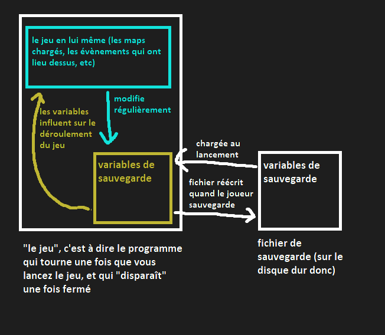

# Sauvegarde
*Note : si vous ne touchez pas aux scripts Lua, alors vous n'avez pas réellement* besoin *de savoir tout ça, et connaittre le fonctionnement de système de sauvegarde n'est pas nécessaire pour mapper par exemple. Il est cependant toujours utile voire agréable de savoir comment tout ça fonctionne "sous le capot", ne serait-ce que pour avoir une meilleure compréhension des mécaniques liées à la sauvegarde et aux variables de sauvegarde, notament dans le mapping.*

Ce qu'on entend par "sauvegarde", dans Solarus, est l'ensemble des données qui sont conservées quand Link change de map, et surtout quand le jeu est fermé.  

Ces données sont conservées sous la forme de **variables de sauvegarde**.   
Chaque variable est constituée d'une clé et d'une valeur, c'est à dire une valeur à laquelle on a donné un nom (clé).  
La valeur peut être : 
- un texte (chaîne de caractères)
- un nombre entier
- un booléen (soit `true` (vrai), soit `false` (faux))


```
Exemples :
- La vie actuelle de Link est stockée dans la variable nommée "current_life". Sa valeur est le nombre de HP (quarts de coeurs) restants de Link.
- La nom que le joueur à choisi est stocké dans la variable "name"
- L'état de la plume de roc (c'est à dire, si le joueur possède ou non la plume de roc) est stocké dans la variable "possesion_feather". Sa valeur est "true" si Link possède la plume. S'il ne la possède pas, la variable n'existe pas (ou a pour valeur "false", dans certains cas rares)
```

*note : le terme anglais pour les variables de sauvegarde est "savegame variable". Même si mes guides se concentreront sur la version française de Solarus, il n'est pas impossible que vous croisiez ce terme en anglais un certain nombre de fois.*

Pour bien saisir ce que sont ces variables et ce qu'elles représentent, il est important de bien comprendre que si une information peut être *conservée après avoir fermé le jeu*, alors elle fait obligatoirement partie des variables de sauvegarde.  
(De plus, lors d'un changement de map, les seules informations qui sont conservées sont les variables de sauvegarde, et celles stockées via les scripts Lua. Sachant que quasiment aucune donnée liée purement au *gameplay* n'est conservée directement dans les scripts Lua, on peut considérer que, côté gameplay, les seules informations conservées entre deux maps sont les variables de sauvegarde).

Les variables de sauvegarde sont chargées depuis le fichier de sauvegarde quand le jeu est lancé (c'est  dire quand le joueur à slectionné ou créé une save, dans l'écran de sélection de sauvegarde, et pas avant), et sauvegardées dans ce fichier quand le joueur décide de sauvegarder depuis le menu. Il faut donc bien comprendre qu'entre ces deux moments, le fichier de sauvegarde n'est jamais touché ; quand une variable de sauvegarde est modifée, c'est au niveau du jeu et non pas du fichier de sauvegarde, ce qui signifie que lorsque le jeu est fermé, toute modification apportée aux variables de sauvegarde depuis la dernière sauvegarde est oubliée.



## Types de variables de sauvegarde

En soi, toutes les variables fonctionnent de la même manière, cependant il existe des différences au niveau de la manière dont elles sont crées/définies et modifiées.
- Les variables dont le nom commence par `_` sont celles **crées et gérées par Solarus**. Elles touchent donc généralement à des concepts et foncitonnalités présents de base dans Solarus, tels que les HP de Link, ou son point de réapparition.  
    ```
    Exemple : la variable "_current_money" (qui contient le nombre de rubis de link) est créée par solarus, et modifiée automatiquement quand le nombre de rubis de link change.
    ```

    Note : il est toujours *possible* de modifier/lire ces variables manuellement via du code, seulement ce n'est pas nécessaire.

- Certaines variables sont **gérées automatiquement par Solarus**, mais **créées par l'utilisateur** (CàD : vous). Il s'agit généralement des variables associées à une entité, telle que les coffres ou les enemis (voir [Mapping](mapping.md)) : elles sont en effet créées par l'utilisateur, dans le sens où c'est vous qui décidez que tel ennemi (par exemple) est lié à une variable dont vous décidez du nom, cependant c'est Solarus qui s'occupera de la modifier, et qui utilisera sa valeur. 
    ```
    Exemple : si vous créez un coffre et décidez que son état sera sauvegardée dans la variable "test_chest", alors cette variable sera créée automatiquement quand Link ouvrira le coffre, et à chaque chargement de la map Solarus ira voir si elle est présente (et possède la valeur "true"), et si oui affichera la coffre déjà ouvert.
    ```
    La plupart de ces variables sont décrites dans le guide dédié au [Mapping](mapping.md).

- Certaines variables sont liées aux **items**. Elles ont un fonctionnement similaire à la catégorie précédentes, mais un peu plus complexe : voir la section [Items](#items)

- Les autres variables ne sont pas gérées par solarus, ce qui signifie qu'elles sont modifiées et lues **manuellement** par des scripts Lua. Cependant on peut encore faire une dernière différenciation : il y a d'un côté celles qui seront gérées "automatiquement" par un des scripts de Fallen Realm, et qui ne nécessiteront pas de coder quoi que ce soit (généralement, celles qui sont liées aux [Map Features](mapping.md#Map-features)) et aux [entités custom](mapping.md#Entités-custom), que vous allez souvent indiquer dans les propriétés custom d'une entité), et les autres, qui ne sont liées à aucune feature ou mécanique existante, modifiées et lues manuellement par vos scripts quand vous en avez besoin.

## Le fichier de sauvegarde
Le fichier de sauvegarde est un fichier texte, où chaque ligne correspond à une variable de sauvegarde.  
```
nom_de_la_variable = valeur
```
Si la valeur est un texte, il est entre guillemets.

Les fichiers de sauvegarde, se trouven, généralement, à l'emplacement 
```
C:/Users/VotreUtilisateurWindows/.solarus/FallenRealm/
```
Ils portent le nom save*N*.dat, où N est le numéro de la save (entre 1 et 3).
## L'API

On en arrive donc à la partie pratique : gérer des variables de sauvegarde soi même. *note : cela va évidemment nécessiter de passer par les scripts et l'API Lua. Il est donc nécessaire de connaitre le fonctionnement basique du Lua, et de l'API solarus.*

Premièrement, les variables de sauvegarde sont liées à l'objet `game` (ce qui fait sens puisque ces variables n'existent que dans le contexte d'une partie lancée). Afin d'accéder à ces variables, il sera donc nécessaire d'accéder à cet objet; il existe pour ça de nombreuses méthodes : par exemple, de très nombreux objets (les Maps, les entités notament) possèdent une méthode `get_game()` qui renvoie l'objet Game.  

On va donc utiliser deux méthodes de cet objet Game :   
- `game:get_value(name)` renvoie la valeur de la variable nommée `name` (rappel : il peut s'agir d'une string, d'un entier, ou d'un booléen), ou `nil` si la variable n'existe pas.
- `game:set_value(name, val)` change la valeur de la variable nommée `name`, la nouvelle valeur étant `val`.

Ces deux méthodes suffisent, de manière générale, à gérer les variables de sauvegarde : les variables sont automatiquement créées quand on essaie d'affcter une valeur à une variable qui n'existe pas encore, et il n'est pas possible de supprimer une variable (affecter la valeur `nil` à une variable de sauvegarde fait exactement comme si elle n'existait plus).

## Variables importantes
Voyons maintenant quelques variables particulières (spécifiques ou non à Fallen Realm), dont il peut être utile de connaitre le fonctionnement.  
- **story_state** : variable contenant un nombre qui indique l'avancement de la quête principale. Le fonctionnement est simple, certains évènements augmentent ce nombre, et beaucoup de script de map adaptent leur fonctionnement au story state actuel. Ainsi, chaque nombre entier à partir de 0 correspond à un état de l'histoire principale.
Cette variable peut être obtenue et modifié par la méthode habituelle, mais aussi avec `game:get_story_state()` et `game:set_story_state(state)` (utiliser ces fonctions revient de toute façon à modifier la variable normalement avec `get/set_story_state`, elle ne sont là que pour la clarté du code)
- **sidequest_*xxx*** : avancement de la quête annexe "xxx". Ces variables fonctionnent de la même manière que `story_state`, elles contiennent un nombre qui correspond à l'état de la sidequest nommée "xxx". Chaque quête annexe possède donc une variable de ce type.  
A noter que le concept de sidequest n'existe pas vraiment dans solarus, et que le fait qu'une sidequest existe et soit nommée "xxx" ne signifie rien d'autre que : il existe une variable de sauvegarde nommée `sidequest_*xxx*`. Ainsi, le fonctionnement des sidequest dépend à 100% de votre utilisation de ces variables.  

## Memo : mécaniques liées au variables de sauvegarde
Cette section regroupe les diverses fonctionnalités et mécaniques liées aux variables de sauvegarde, déjà présentées dans d'autres guides divers.

- Sauvegarde de l'état d'une entité (Solarus) : solarus permet de lier une variable de sauvegarde à certaines entités ([enemi](mapping.md#enemi), coffre, pickable) afin que leur état soit sauvegardé dans une variable choisie par l'utilisateur.
- Certaines entités custom

[Retour au sommaire](starting.md)

