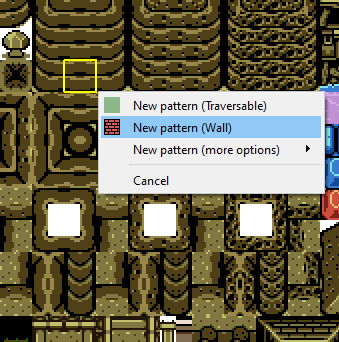
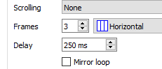

# Tilesets
*Ce guide présente a pour but d'expliquer le fonctionnement interne des tilesets, et la manière de les créer. Pour une explication du concept et comment utiliser les tilesets, le guide [Mapping](mapping.md) suffit.*

## Concept
Un tileset est un ensemble de "**patterns**", petits éléments qui serviront à créer le décor d'une map, ainsi que son terrain (murs, etc).  (note : les patterns sont parfois appelés "tiles" par bus de langage, les tiles désignant en réalité les patterns *une fois placés sur une map* : les tiles placées se basent sur les patterns du tileset).
Chaque tileset est constitué d'une **image source** (*nomDuTileset*.tiles.png), qui tous ses patterns, et d'un **fichier de donnée** (*nomDuTileset.dat*) qui contient, pour chaque pattern, son emplacement sur l'image source et quelques autres informations.   
Un tileset peut aussi posséder une autre image appelée **Tileset Entities** (*nomDuTileset.entities.png*), qui permet à certains sprites de changer d'apparence en fonction du tileset, mais cela sera développé plus en profondeur dans le guide [Sprites](sprites.md).  

## Les patterns
Ainsi, un tileset est simplement une liste de patterns, qui accompagnée d'une image source.  
Chaque pattern possède possède :
- une apparence, basée sur une zone de l'image source du tileset. A noter qu'une tile peut être animée et posséder plusieurs frames (qui sont alors des zones adjacentes de l'image source).
- un mode de répétition, qui détermine si et comment ce pattern peut être répété lors de la création d'une tile.
- Un type de Terrain.

### Terrains
Chaque pattern possède un type de terrain, parmi un dizaine de terrains existants. Chaque terrain possède un comportement vis à vis des entités entrant en contact avec la tile.

Terrain|Fonctionnement
-|-
Traversable|Aucun
Mur|Ne peut être traversé
Muret|Peut être traversé par certains entités uniquement
Herbe|Ralentit légèrement Link, affiche une petite animation et joue un son quand il marche dedans
Eau peu profonde|Ralentit légèrement Link, affiche une petite animation et joue un son quand il marche dedans
Eau profonde|Si Link marche dedans, il perd de la vie et est ramené au début de la salle.
Pics|Si Link marche dedans, il perd de la vie et est ramené au début de la salle.
Lave|Si Link marche dedans, il perd de la vie et est ramené au début de la salle.
Trou|Si Link marche dedans, il perd de la vie et est ramené au début de la salle.
Glace|Link glisse dessus.
Vide|Rarement utilisé, Link "tombera" de couche en couche jusqu'à arriver sur un tile non-vide s'il se retrouve entièrement sur des tiles vides.

Note : les terrains qui infligent des dégats à link et le font revenir au début de la salle sont traités comme des obstacles par les IA des enemis, qui meurent s'ils se retrouvent malgré tout dedans.

## Maps et utilisation des tilesets
La manière d'utiliser les tiles sur une map est expliquée en détail dans le guide [Mapping](mapping.md), la manière dont les tiles fonctionnent au sein des maps est traitée dans le guide [Maps](maps.md). 
Rappelons simplement qu'une map est un ensemble de tiles, et qu'une tile se base toujours sur un pattern, et peut être composé d'une **répétition** de ce pattern (si ledit pattern a été configuré pour être répétable).

## Édition de tileset
Pour créer un nouveau tileset, dans Solarus, `clic droit sur le dossier Tilesets (ou sur un sous dossier) -> Nouveau Tileset`. Dans la fenêtre de prompt qui s'affiche, le nom sera le nom du fichier et la description le "nom d'affichage" (que solarus utilisera dans ses menus).

Solarus vient de créer le fichier *monTileset*.dat, que vous pouvez ouvrir dans Solarus (via l'arborescence de droite) pour accéder à l'éditeur de tileset. Cependant on ne pourra rien faire pour l'instant, le tileset étant incomplet : il faut en effet ajouter l'image source. Pour ça, on ne pourra pas passer par solarus, il faudra prendre l'image qui servira de source, la placer dans le même dossier que notre tileset, et l'appeler *monTileset*.tiles.png (puis fermer et rouvrir le tileset car Solarus est un peu con).  

 

On peut maintenant commencer à éditer le tileset, c'est à dire créer des patterns.  

Pour créer un pattern, c'est très simple : on sélectionne la zone de l'image source qui sera l'apparence de ce pattern, et on choisit le type de terrain du pattern.  
Une fois le pattern créé, il ne reste plus qu'à le configurer, en le sélectionnant dans la liste des patterns à gauche, ses propriétés apparaissant alors dans la zone juste en dessous  
  

Ces propriétés sont : 
- **L'id du pattern** : chaque pattern possède un nom. Même s'il n'est généralement important que pour solarus (vu que pour utiliser les patterns vous allez juste les sélectionner dans l'éditeur de map), il est possible de le changer.
- Le **type de terrain**
- La **couche par défaut** : indique la couche à laquelle se placera une tile créée à partir de ce pattern. Sachant qu'en général les maps utilisent toujours la même couche pour le sol (dans Fallen realm tout se passe généralement en couche 1), cela peut être utile pour des patterns qui seront généralement au dessus des entités par exemple (feillages des arbres, etc), qu'on mettre en couche 2 par défaut.
- Le **comportement de répétition** : indique si et comment ce pattern peut être répétée. Certains patterns ne peuvent pas être répétés, certains peuvent être répétés librement (e.g. patterns de sol), et certains ne peuvent être répétés que verticalement ou horizontalement (e.g. patterns de murs). On notera qu'il est tout à fait possible de configurer *tous* les patterns en répétable librement (vu que cette configuration ne fait que *limiter* les répétitions tout ce qui est faisable avec les autres options le sera aussi si la répétition est libre), cette option n'est là que pour faciliter le mapping.
- Le **mode de scrolling** : je sais pas ? J'avais jamais vu cette fonctionnalité, à voir ._.
- **L'animation** : permet de créer des patterns animés.  

### Patterns animés
Un pattern animé est composé de plusieurs frames, qui doivent être adjacentes sur l'image source.  
Pour créer un pattern animé, il faut d'abord créer un pattern qui sera la première frame de l'animation, puis choisir le nombre de frames dans les propriétés. Les autres frames seront alors créées automatiquement, alignées (horizontalement ou verticalement, configurable à côté du nombre de frames) à partir du pattern original.  

 

Il s'agit toujours d'un seul et même pattern.  
Il ne reste plus qu'à choisir un délai entre les frames ; la dernière option ("mirror loop") indique à solarus qu'au lieu de revenir à la première frame en arrivant à la fin, il doit repartir en arrière jusqu'à la première frame et ainsi de suite.  

[Retour au sommaire](starting.md)